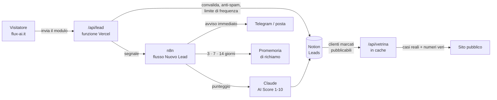

# Obiettivi 2026 — Flux AI

**Goal condiviso di tutti gli agenti che lavorano su questo repository.
Scadenza: 31 dicembre 2026.**

Questo file è la fonte di verità per *cosa* va costruito su questo sito e in che
ordine. Il registro operativo completo — con stato, responsabile e scadenza di
ogni voce — sta nel database Notion **🎯 Obiettivi 2026** dentro 📌 CRM
(Dashboard). Il ragionamento che ci sta dietro sta nel **Dossier di Audit del
2 agosto 2026**, nello stesso spazio.

---

## L'obiettivo, in una riga

Il sito deve **raccogliere**. Oggi la sezione Contatti ha solo due link
`mailto:` e nessun campo: il CRM ha l'opzione «Sito web» fra le fonti dei lead
e quell'opzione non può popolarsi. Entro fine 2026 la pagina scrive nel CRM e
il CRM alimenta la pagina.

---

## Regole per gli agenti

1. **Prima di aprire un lavoro nuovo**, controlla se in 🎯 Obiettivi 2026 c'è
   una riga con il tuo nome ancora aperta. Si finisce quella.
2. **Nessun agente prende un obiettivo assegnato a un altro.** I territori di
   scrittura non si sovrappongono: è la contromisura alla collisione fra agenti
   del 25 luglio 2026.
3. Un obiettivo si dichiara **Fatto** solo quando il criterio in «Come si
   verifica» è soddisfatto — *non* quando il lavoro è scritto. Codice sul
   branch non è codice in produzione.
4. **Niente di nuovo finché l'ultimo costruito non è in produzione.** È la
   regola che vale più di tutte le altre in questo file. Il collo di bottiglia
   di questo progetto non è la capacità di costruire, è l'ultimo miglio.
5. **Nessun segreto nel repository.** Questo repo è pubblico. Chiavi e token
   stanno nelle variabili d'ambiente di Vercel o nel credential store di n8n,
   mai nel codice, mai negli URL dei remote git, mai nei workflow.

---

## Le fasi

Cinque fasi in ordine di dipendenza: ciascuna sblocca la successiva. Le stime
sono giornate di lavoro effettivo.

### Fase 0 — Mettere in sicurezza prima di aprire i rubinetti
*Mezza giornata · entro il 9 agosto · nessuna riga di codice: decisioni e testi*

- [ ] **Informativa privacy** raggiungibile dal footer, con titolare del
      trattamento, finalità (gestione della richiesta di contatto), Notion come
      responsabile esterno, tempi di conservazione e diritti dell'interessato.
      Serve prima che qualsiasi modulo vada online: art. 13 GDPR, e il pubblico
      di questo sito sono studi legali.
- [ ] **Partita IVA nel piè di pagina.** Oggi il footer dice «Partita IVA da
      inserire».
- [ ] **Dominio e posta:** `flux-ai.it` deve puntare a Vercel, e va verificato
      che i messaggi inviati ai due indirizzi pubblicati sul sito arrivino
      davvero. Finché non esiste un modulo, la posta è l'unico canale.
- [ ] **Un solo indirizzo ufficiale.** Vercel ospita la produzione; GitHub Pages
      resta uno specchio senza backend. Pages non può eseguire funzioni
      serverless: dal momento in cui esiste `/api/`, i due indirizzi smettono di
      essere equivalenti.
- [ ] **Igiene credenziali:** allineare `README_DEPLOYMENT.md`, che oggi
      documenta il push con il token dentro l'URL del remote. Va sostituito con
      SSH o il credential helper.

### Fase 1 — La pagina raccoglie
*2 giornate · entro il 23 agosto · è il pezzo centrale*

- [ ] **Modulo nella sezione Contatti:** nome, attività, posta, servizio di
      interesse, messaggio, casella di consenso con link all'informativa. Poche
      righe, coerenti con la direzione *Strumentazione*.
- [ ] **Funzione `/api/lead` su Vercel** come unico punto di scrittura:
      convalida lato server, campo trappola anti-robot, limite di frequenza,
      scrittura nel database Leads. La chiave Notion sta nelle variabili
      d'ambiente. *Chiamare l'API di Notion dal browser è escluso: metterebbe
      un token con permessi di scrittura sull'intero CRM nel sorgente della
      pagina.*
- [ ] **Nuove proprietà nel database Leads:** Messaggio, Servizio di interesse,
      Consenso informativa, Data consenso, Origine tecnica.
- [ ] **Allineare gli stati del SOP a quelli reali del database.** Oggi
      divergono: un'automazione scritta seguendo il manuale fallirebbe alla
      prima scrittura.
- [ ] Ogni riga entra con Fonte «Sito web» e Status «Nuovo».

### Fase 2 — Il CRM alimenta la pagina
*1 giornata · entro il 31 agosto · il collegamento diventa reciproco*

- [ ] **`/api/vetrina`:** legge dal CRM i clienti marcati pubblicabili, con
      cache — il piano Notion conta le interrogazioni programmatiche.
- [ ] **`METRICHE` in `assets/js/main.js` smette di essere scritto a mano** e
      diventa una lettura del CRM. Oggi è un oggetto di valori segnaposto con
      `provvisorio: true`.
- [ ] **`provvisorio: false`** con numeri veri, anche piccoli. Un numero vero
      vale più di uno gonfiato, soprattutto davanti a un pubblico che verifica.
      È anche la tesi della direzione visiva scelta per questo sito: mostrare
      misure, non promesse.

### Fase 3 — Il seguito non dipende dalla memoria di nessuno
*2 giornate · entro il 15 settembre · territorio dell'agente `automazioni`*

- [ ] **Flusso n8n «Nuovo Lead»:** riceve il segnale da `/api/lead`, chiama
      Claude col Prompt Master già scritto nel SOP, riscrive AI Score e Priorità
      in Notion.
- [ ] **Avviso immediato** (Telegram) entro un minuto da ogni richiesta.
- [ ] **Promemoria a 3, 7 e 14 giorni** sui lead senza risposta, letti dal campo
      «Data prossima azione» — che oggi esiste e non lo legge nessuno.
- [ ] **Gestione errori:** nuovi tentativi sui nodi di rete e ramo di errore che
      conserva il payload. Se Notion non risponde, il lead non si perde.

### Fase 4 — Il CRM regge un'attività, non solo dei contatti
*2–3 giornate · entro il 30 settembre · territorio dell'agente `azienda`*

- [ ] Valore Progetto e Stato Pagamento su Clienti Attivi.
- [ ] Nuovo database Abbonamenti per i prodotti a canone.
- [ ] Corsi reali al posto dei segnaposto in Studenti.
- [ ] Vista cruscotto in Notion: ricavo del mese, ricorrente attivo, lead per
      fonte, tasso di conversione.

---

## Architettura di riferimento

n8n **non è il portiere**: è l'orchestratore a valle. La funzione Vercel
risponde in mezzo secondo e passa la mano. Punteggio, promemoria e notifiche
possono richiedere secondi e fallire senza che il visitatore veda un errore.

---

## Cosa spetta a Ergest, non agli agenti

Ciascuna di queste blocca del lavoro a valle e nessun agente può deciderla:

- Indirizzo ufficiale: Vercel o Pages.
- Se `flux-ai.it` è registrato e con la posta attiva.
- La chiave di integrazione Notion, da creare e condividere con i database
  Leads e Clienti Attivi.
- Partita IVA e titolare del trattamento.
- Se i prodotti ancora in beta restano a listino con il prezzo esposto.

---

*Derivato dal Dossier di Audit del 2 agosto 2026. Aggiornare lo stato delle
voci nel database Notion 🎯 Obiettivi 2026, non in questo file: qui vive il
piano, là vive l'avanzamento.*
